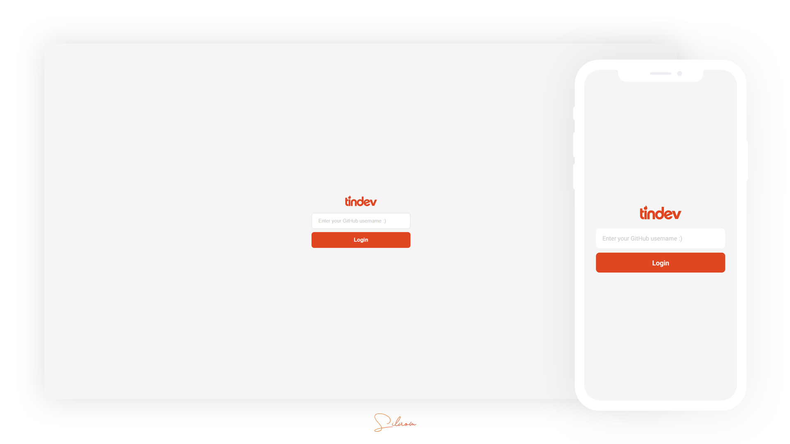
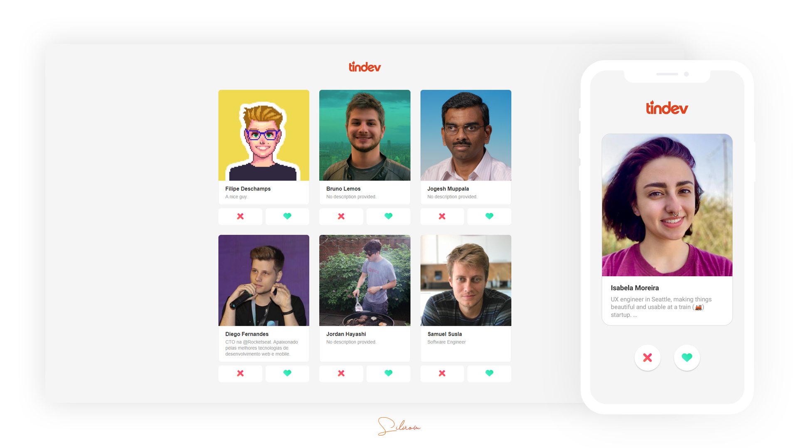

# Tindev
:heart: A tinder for devs. 

Cross-platform application developed for study purposes with NodeJS, ReactJS and React Native during [@Rocketseat](https://github.com/rocketseat)'s "Semana Omnistack 8" event.

Technologies and tools used in this project:

- JavaScript
- Node.js
- Express
- MongoDB
- Mongoose
- Socket.io
- Axios
- React
- React Native
- React Navigation

