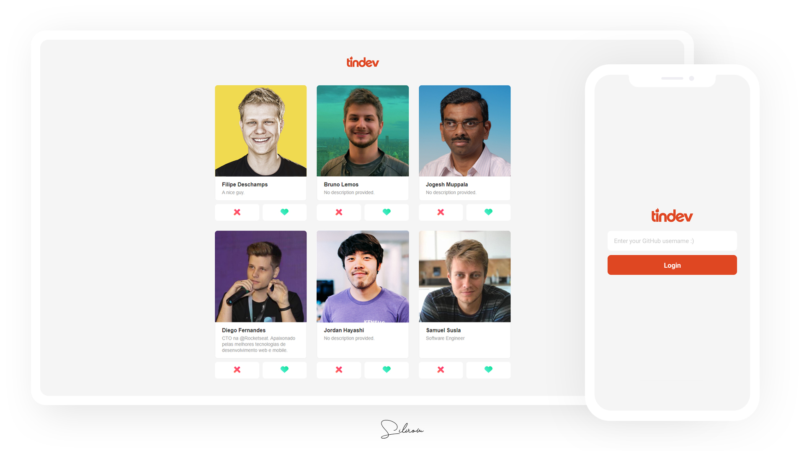

# Tindev
:heart: A tinder for devs. 

Cross-platform application developed for study purposes with Node.js, React.js and React Native during [@Rocketseat](https://github.com/rocketseat)'s "Semana Omnistack 8" event.

Technologies and tools used on this project:

- Node.js
- Express
- MongoDB
- Mongoose
- Socket.io
- React.js
- React Native

